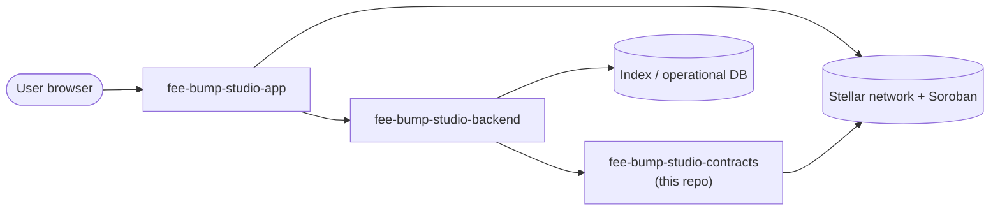

<div align="center">


# FeeBumpStudio Contracts

*The Soroban contract layer of FeeBumpStudio* 🛠️

[](LICENSE)
[](https://github.com/FeeBumpStudio/fee-bump-studio-contracts/actions/workflows/ci.yml)


</div>

---

## Why this exists

A developer workflow for **inspecting a transaction, estimating a replacement fee, preparing fee-bump envelopes, and keeping the original transaction intent visible for review**.

The contract repository owns only the state transitions that benefit from Stellar's verifiability. It does not attempt to become the application's database. The boundary is deliberate: **contract state proves the important protocol event**, while off-chain services handle indexing, search, presentation, and operational workflows.

### Where this repo fits

| Repo | Role |
| --- | --- |
| [`fee-bump-studio-app`](https://github.com/FeeBumpStudio/fee-bump-studio-app) | Web application, integration client, user workflow |
| **`fee-bump-studio-contracts`** (this repo) | Soroban/Rust protocol layer and contract tests |
| [`fee-bump-studio-backend`](https://github.com/FeeBumpStudio/fee-bump-studio-backend) | Indexing, analysis, APIs, jobs, operational services |

## Core responsibilities

- Define the **minimal on-chain state model**
- Enforce **authorization at the contract boundary** (`require_auth` on every state change)
- Emit useful **events for indexers and audit tooling**
- Keep sensitive or bulky information **off-chain**
- Provide **deterministic unit tests** for protocol behavior

> ⚠️ **Status:** development baseline, Testnet-oriented. This contract is **not audited** and **not production-ready**. Do not deploy it with real value.

## Documentation

📖 **Full documentation:** [https://feebumpstudio.github.io/fee-bump-studio-contracts/](https://feebumpstudio.github.io/fee-bump-studio-contracts/)

The documentation site includes:
- Getting Started guides
- Contract Guide (architecture, interface, storage, auth, events, testing, deployment)
- Developer Guide (project structure, local development, building, contributing)
- API Reference (functions, storage keys, errors, TypeScript client)
- Configuration reference
- Operations guides (deployment, upgradeability, monitoring)
- Security and FAQ

## Current contract surface

The `FeeBumpStudioContract` exposes:

| Function | Access | Behavior |
| --- | --- | --- |
| `initialize(admin)` | `admin.require_auth()` | Stores the admin address in instance storage |
| `record(actor, reference)` | `actor.require_auth()` | Persists `reference` under the actor's address (persistent storage) |
| `read(actor) → Option<String>` | public | Reads back the stored reference |

See [docs/ARCHITECTURE.md](docs/ARCHITECTURE.md) for the design rationale and the planned project-specific state model.

## Architecture



## Tech stack

| Layer | Technology |
| --- | --- |
| Language | Rust (`no_std`, `cdylib` crate) |
| Contract SDK | [soroban-sdk](https://crates.io/crates/soroban-sdk) 28 |
| Tests | `cargo test` (soroban-sdk `testutils`) |
| Build | [`stellar contract build`](https://developers.stellar.org) / `Makefile` |

## Project structure

```text
fee-bump-studio-contracts/
├── src/            # lib.rs — the Soroban contract
├── tests/          # contract behavior tests
├── docs/           # ARCHITECTURE and protocol notes
├── Makefile        # build/test shortcuts
├── Cargo.toml      # crate manifest (release profile tuned for size)
└── .env.example    # environment variable template
```

## Prerequisites

- Rust ≥ 1.75 (`rustup`)
- [`stellar` CLI](https://developers.stellar.org/docs/tools/cli/stellar-cli) (for on-chain builds)

## Installation

```bash
cargo build
```

## Environment variables

```bash
cp .env.example .env  # fill in per-deployment values
```

| Variable | Purpose |
| --- | --- |
| `STELLAR_NETWORK` | Target network (`testnet` by default) |
| `STELLAR_RPC_URL` | Soroban RPC endpoint (empty = public Testnet default) |
| `STELLAR_CONTRACT_ID` | Deployed contract ID for app/backend integration (not hard-coded here) |

Contract identifiers are environment-specific and are intentionally **not** hard-coded into this repository.

## Running locally

```bash
cargo test        # host-side test run
```

## Testing philosophy

Tests should cover happy paths, invalid inputs, unauthorized callers, repeated calls, boundary values, and state transitions. **A green test suite is not an audit.**

## Building / deploying

```bash
make build        # stellar contract build (wasm)
make test         # cargo test
```

Production deployment is a separate engineering step that requires network configuration, contract review, migration planning, monitoring, and security review. The app and backend repos consume this layer through generated bindings or Stellar SDK calls.

## Roadmap

- [ ] Complete protocol-specific storage model
- [ ] Add authorization edge-case tests
- [ ] Add event/indexing fixtures
- [ ] Test against Stellar Testnet
- [ ] Document deployment and upgrade procedure
- [ ] Perform an independent security review before production

## Contributing

Contributions are welcome! Please read [CONTRIBUTING.md](CONTRIBUTING.md) before opening a PR.

## Security

Please report vulnerabilities privately instead of filing public issues — see [SECURITY.md](SECURITY.md). Review and audit requests follow the same channel.

## Code of Conduct

Be kind and respectful. This project follows contributor norms of good conduct as described in [CONTRIBUTING.md](CONTRIBUTING.md); a dedicated Code of Conduct file is coming as the community grows.

## Maintainer

**Jubilee** ([@Jubilee-001](https://github.com/Jubilee-001))

## License

Distributed under the [MIT License](LICENSE).