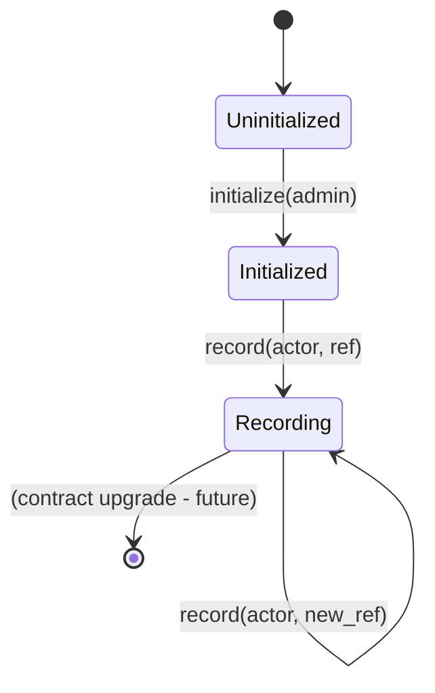

# Contract Architecture

## Responsibility

The FeeBumpStudio contract provides minimal on-chain state for verifiable fee-bump event recording. It does not attempt to become the application's database.

**Boundary principle**: Contract state proves the important protocol event; off-chain services handle indexing, search, presentation, and operational workflows.

## Security Boundary

Every state-changing operation must authenticate the actor allowed to cause the change:

```rust
// Initialize: admin must authorize
admin.require_auth();

// Record: actor must authorize
actor.require_auth();

// Read: public (no auth required)
```

Contract storage is intentionally smaller than the application database.

## Storage Model

```
Instance Storage (per-contract, small):
  "admin" → Address

Persistent Storage (per-key, larger):
  Address (actor) → String (reference)
```

| Storage Type | Use Case | Size Limit |
|--------------|----------|------------|
| **Instance** | Contract metadata (admin) | ~100 KB |
| **Persistent** | Actor → reference mapping | ~100 KB per key |

## Current State Machine



### States

| State | Description |
|-------|-------------|
| **Uninitialized** | Contract deployed, no admin set |
| **Initialized** | Admin stored, ready for records |
| **Recording** | Actors can record/read references |

## Function Specifications

### `initialize(admin: Address)`

| Property | Value |
|----------|-------|
| **Access** | `admin.require_auth()` |
| **Storage** | Instance: `"admin"` → `admin` |
| **Idempotent** | No (fails if already initialized) |
| **Events** | None (baseline) |

### `record(actor: Address, reference: String)`

| Property | Value |
|----------|-------|
| **Access** | `actor.require_auth()` |
| **Storage** | Persistent: `actor` → `reference` |
| **Idempotent** | Yes (overwrites previous) |
| **Events** | None (baseline) |

### `read(actor: Address) → Option<String>`

| Property | Value |
|----------|-------|
| **Access** | Public |
| **Storage** | Persistent read: `actor` |
| **Returns** | `Some(reference)` or `None` |

## Future Specification

The generic development contract in this baseline must be replaced with the project-specific state model before production deployment. Planned extensions:

| Feature | Description |
|---------|-------------|
| **Fee-bump event records** | Structured event data (tx hash, fees, status) |
| **Batch operations** | Multiple records per transaction |
| **Query helpers** | Pagination, filtering by date/actor |
| **Upgradeability** | Proxy pattern with timelock |

## Integration Points

| Component | Interaction |
|-----------|-------------|
| **App** | Constructs transactions, submits via wallet |
| **Backend** | Indexes events, provides query API |
| **Stellar Network** | Executes transactions, stores state |

## Design Principles

| Principle | Implementation |
|-----------|----------------|
| **Minimal surface** | Only 3 functions |
| **Explicit auth** | `require_auth` on all writes |
| **No hidden state** | All storage readable |
| **Deterministic** | Same input → same output |
| **Testable** | Host tests with `mock_all_auths` |

## Related Documentation

- [Interface](interface.md)
- [Storage](storage.md)
- [Authorization](authorization.md)
- [Events](events.md)
- [Testing](testing.md)
- [Deployment](deployment.md)