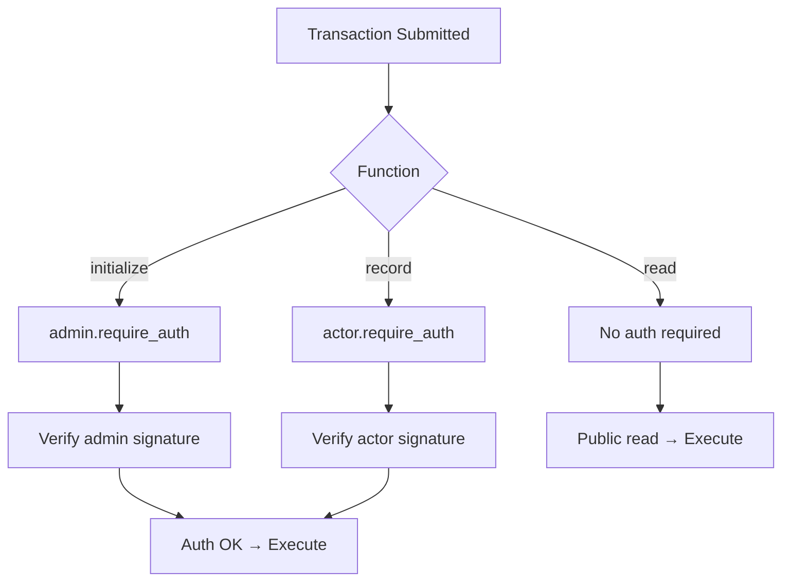

# Authorization

## Overview

Every state-changing operation in the FeeBumpStudio contract requires explicit authorization from the relevant actor. This is enforced via Soroban's `require_auth()` mechanism.

## Authorization Model



## Function Authorization

### `initialize(admin: Address)`

```rust
pub fn initialize(env: Env, admin: Address) {
    admin.require_auth();  // ← Admin must sign
    env.storage().instance().set(&String::from_str(&env, "admin"), &admin);
}
```

| Requirement | Detail |
|-------------|--------|
| **Signer** | `admin` address |
| **Auth Type** | Full authorization (can sign any transaction) |
| **Purpose** | Prove admin controls the contract |

### `record(actor: Address, reference: String)`

```rust
pub fn record(env: Env, actor: Address, reference: String) {
    actor.require_auth();  // ← Actor must sign
    env.storage().persistent().set(&actor, &reference);
}
```

| Requirement | Detail |
|-------------|--------|
| **Signer** | `actor` address |
| **Auth Type** | Full authorization |
| **Purpose** | Prove actor owns the reference |

### `read(actor: Address) → Option<String>`

```rust
pub fn read(env: Env, actor: Address) -> Option<String> {
    env.storage().persistent().get(&actor)  // ← No auth required
}
```

| Requirement | Detail |
|-------------|--------|
| **Signer** | None |
| **Auth Type** | Public (no authorization) |
| **Purpose** | Allow anyone to verify records |

## Authorization Flow

### TypeScript (App)

```typescript
// Initialize: admin signs
await contract.initialize({ admin: adminKeypair.publicKey() })
  .prepare({ authorize: [adminKeypair.publicKey()] })
  .sign(adminKeypair)
  .submit();

// Record: actor signs
await contract.record({ 
  actor: actorKeypair.publicKey(), 
  reference: "TX-abc-001" 
})
  .prepare({ authorize: [actorKeypair.publicKey()] })
  .sign(actorKeypair)
  .submit();

// Read: no auth needed
const result = await contract.read({ actor: actorKeypair.publicKey() });
```

### Rust (Tests)

```rust
let env = Env::default();

// Option 1: Mock all auths (simplest for tests)
env.mock_all_auths();

// Option 2: Explicit auth per call
let admin = Address::generate(&env);
let actor = Address::generate(&env);

let contract_id = env.register(FeeBumpStudioContract, ());
let client = FeeBumpStudioContractClient::new(&env, &contract_id);

// Client handles auth automatically based on function signature
client.initialize(&admin);      // Adds admin auth
client.record(&actor, &ref);    // Adds actor auth
client.read(&actor);            // No auth added
```

## Authorization Errors

| Error | Cause | Resolution |
|-------|-------|------------|
| `HostError: AuthFailed` | Missing signature | Add correct signer to `authorize` |
| `HostError: AuthFailed` | Wrong signer | Ensure signer matches function parameter |
| `HostError: AuthFailed` | Expired auth | Re-prepare transaction (auth has TTL) |

## Auth Composition

Soroban supports complex auth compositions:

```rust
// Example: Multi-sig requirement (future)
fn multi_sig_record(env: Env, actors: Vec<Address>, reference: String) {
    for actor in actors.iter() {
        actor.require_auth();  // Each must sign
    }
    // ... store
}
```

## Auth TTL (Time-to-Live)

Authorizations have a TTL (time-to-live):

- **Default**: Current ledger + ~100 ledgers (~5 minutes)
- **Purpose**: Prevent replay of old authorizations
- **Impact**: Prepare → Sign → Submit must complete within TTL

## Best Practices

| Practice | Reason |
|----------|--------|
| **Minimal auth scope** | Only authorize what's needed |
| **Explicit auth in tests** | Use `mock_all_auths()` for simplicity |
| **Prepare → Sign → Submit** | Standard wallet flow |
| **Handle auth failures** | User-friendly error messages |

## Future Extensions

| Feature | Auth Change |
|---------|-------------|
| **Batch record** | Multiple actors in single tx |
| **Delegated auth** | Actor authorizes delegate |
| **Role-based** | Admin/operator/viewer roles |
| **Time-locked** | Delayed execution |

## Related Documentation

- [Architecture](architecture.md)
- [Interface](interface.md)
- [Testing](testing.md)
- [TypeScript Client](../api-reference/typescript-client.md)