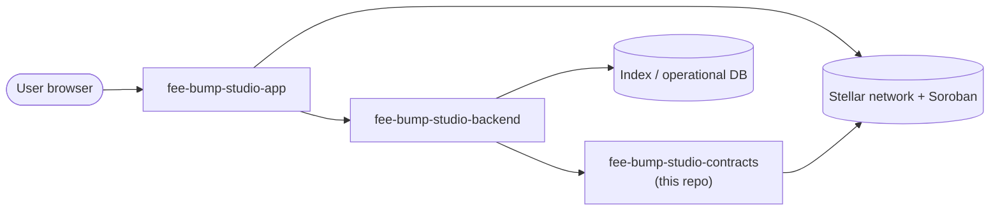

# FeeBumpStudio Contracts

**The Soroban contract layer of FeeBumpStudio**

---

## Overview

FeeBumpStudio Contracts provides the minimal on-chain state layer for verifiable fee-bump event recording on Stellar.

The contract repository owns only the state transitions that benefit from Stellar's verifiability. It does not attempt to become the application's database. The boundary is deliberate: **contract state proves the important protocol event**, while off-chain services handle indexing, search, presentation, and operational workflows.

---

## Project Status

> ⚠️ **Development Baseline** — Testnet-oriented. This contract is **not audited** and **not production-ready**. Do not deploy it with real value.

---

## Quick Links

| Resource | Link |
|----------|------|
| **GitHub Repository** | [FeeBumpStudio/fee-bump-studio-contracts](https://github.com/FeeBumpStudio/fee-bump-studio-contracts) |
| **Issue Tracker** | [GitHub Issues](https://github.com/FeeBumpStudio/fee-bump-studio-contracts/issues) |
| **Security Policy** | [SECURITY.md](https://github.com/FeeBumpStudio/fee-bump-studio-contracts/blob/main/SECURITY.md) |
| **Contributing Guide** | [CONTRIBUTING.md](https://github.com/FeeBumpStudio/fee-bump-studio-contracts/blob/main/CONTRIBUTING.md) |
| **App Documentation** | [fee-bump-studio-app docs](https://feebumpstudio.github.io/fee-bump-studio-app/) |
| **Backend Documentation** | [fee-bump-studio-backend docs](https://feebumpstudio.github.io/fee-bump-studio-backend/) |

---

## Core Responsibilities

- Define the **minimal on-chain state model**
- Enforce **authorization at the contract boundary** (`require_auth` on every state change)
- Emit useful **events for indexers and audit tooling**
- Keep sensitive or bulky information **off-chain**
- Provide **deterministic unit tests** for protocol behavior

---

## Current Contract Surface

The `FeeBumpStudioContract` exposes:

| Function | Access | Behavior |
|----------|--------|----------|
| `initialize(admin)` | `admin.require_auth()` | Stores the admin address in instance storage |
| `record(actor, reference)` | `actor.require_auth()` | Persists `reference` under the actor's address (persistent storage) |
| `read(actor) → Option<String>` | public | Reads back the stored reference |

See [Contract Architecture](contract-guide/architecture.md) for the design rationale and the planned project-specific state model.

---

## Architecture Overview



---

## Technology Stack

| Layer | Technology |
|-------|------------|
| **Language** | Rust (`no_std`, `cdylib` crate) |
| **Contract SDK** | [soroban-sdk](https://crates.io/crates/soroban-sdk) 28 |
| **Tests** | `cargo test` (soroban-sdk `testutils`) |
| **Build** | [`stellar contract build`](https://developers.stellar.org) / `Makefile` |

---

## Getting Started

### Prerequisites

- **Rust** ≥ 1.75 (`rustup`)
- [`stellar` CLI](https://developers.stellar.org/docs/tools/cli/stellar-cli) (for on-chain builds)

### Installation

```bash
git clone https://github.com/FeeBumpStudio/fee-bump-studio-contracts.git
cd fee-bump-studio-contracts
cargo build
```

### Configuration

```bash
cp .env.example .env  # fill in per-deployment values
```

Required environment variables:

| Variable | Description | Default |
|----------|-------------|---------|
| `STELLAR_NETWORK` | Target network | `testnet` |
| `STELLAR_RPC_URL` | Soroban RPC endpoint | (public Testnet default) |
| `STELLAR_CONTRACT_ID` | Deployed contract ID for app/backend integration | (not hard-coded) |

Contract identifiers are environment-specific and are intentionally **not** hard-coded into this repository.

### Running Tests

```bash
cargo test        # host-side test run
```

---

## Where This Repo Fits

| Repository | Role |
|------------|------|
| [`fee-bump-studio-app`](https://github.com/FeeBumpStudio/fee-bump-studio-app) | Web application, integration client, user workflow |
| **`fee-bump-studio-contracts`** | Soroban/Rust protocol layer and contract tests |
| [`fee-bump-studio-backend`](https://github.com/FeeBumpStudio/fee-bump-studio-backend) | Indexing, analysis, APIs, jobs, operational services |

---

## Maintainer

**Jubilee** ([@Jubilee-001](https://github.com/Jubilee-001))

---

## License

Distributed under the [MIT License](https://github.com/FeeBumpStudio/fee-bump-studio-contracts/blob/main/LICENSE).