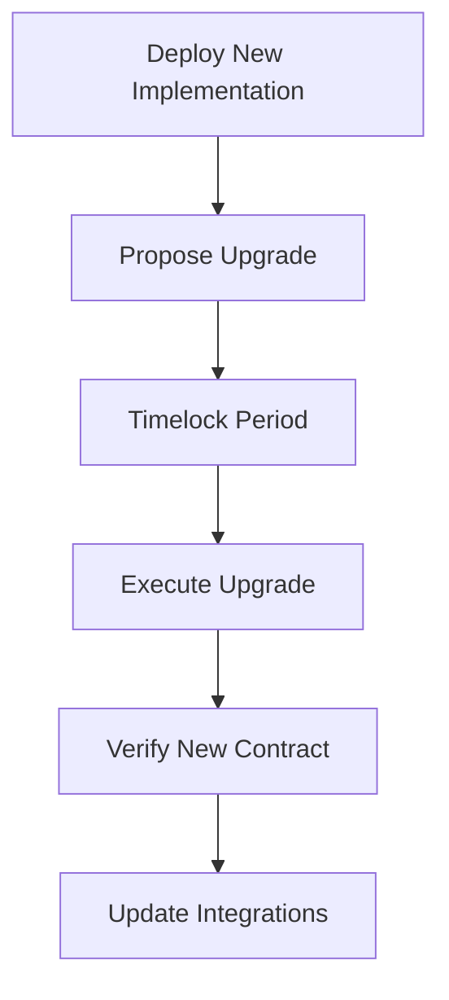

# Upgradeability

## Current State

The baseline contract is **immutable** — no upgrade mechanism exists. Once deployed, the contract code cannot be changed.

## Why Immutability?

| Benefit | Description |
|---------|-------------|
| **Trust minimization** | Users know code never changes |
| **Auditability** | Audited code = running code |
| **Simplicity** | No proxy/admin complexity |
| **Security** | No upgrade attack surface |

## When Upgradeability Is Needed

| Scenario | Solution |
|----------|----------|
| **Bug fixes** | Redeploy new contract |
| **Feature additions** | New contract version |
| **Protocol upgrades** | New contract, migrate state |
| **Emergency pauses** | Not supported in baseline |

## Future: Proxy Pattern

For production, consider upgradeable proxy:

```rust
// Proxy contract (simplified)
#[contract]
pub struct UpgradeableProxy;

#[contractimpl]
impl UpgradeableProxy {
    pub fn __constructor(env: Env, admin: Address, implementation: BytesN<32>) {
        admin.require_auth();
        env.storage().instance().set(&DataKey::Admin, &admin);
        env.storage().instance().set(&DataKey::Implementation, &implementation);
    }

    pub fn upgrade(env: Env, new_wasm_hash: BytesN<32>) {
        let admin: Address = env.storage().instance().get(&DataKey::Admin).unwrap();
        admin.require_auth();
        
        // Timelock check
        let timelock: u64 = env.storage().instance().get(&DataKey::Timelock).unwrap_or(0);
        let now = env.ledger().timestamp();
        if now < timelock {
            panic!("Timelock not expired");
        }
        
        env.storage().instance().set(&DataKey::Implementation, &new_wasm_hash);
        env.deployer().update_current_contract_wasm(new_wasm_hash);
    }
}
```

## Timelock

```rust
const DEFAULT_TIMELOCK: u64 = 7 * 24 * 60 * 60; // 7 days

// Set during initialization
env.storage().instance().set(&DataKey::Timelock, &DEFAULT_TIMELOCK);

// Upgrade checks timelock
let timelock = env.storage().instance().get(&DataKey::Timelock).unwrap();
let now = env.ledger().timestamp();
if now < timelock {
    panic!("Upgrade timelock not expired");
}
```

## State Migration

If upgrading with state changes:

```rust
pub fn migrate_state(env: Env, old_admin: Address) {
    // Read old storage
    let admin = env.storage().instance().get(&DataKey::Admin).unwrap();
    
    // Transform data if schema changed
    // ...
    
    // Write new storage format
    env.storage().instance().set(&DataKey::AdminV2, &admin);
}
```

## Upgrade Process



## Governance

| Role | Responsibility |
|------|----------------|
| **Admin** | Propose upgrades, manage timelock |
| **Community** | Review proposals, signal support |
| **Auditors** | Review new implementation |

## Emergency Procedures

| Scenario | Action |
|----------|--------|
| **Critical bug** | Deploy new contract, migrate users |
| **Compromised admin** | Not recoverable (immutable baseline) |
| **Protocol break** | Coordinate with Stellar core |

## Related Documentation

- [Deployment](deployment.md)
- [Architecture](../contract-guide/architecture.md)
- [Security - Assumptions](../security/assumptions.md)